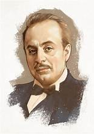
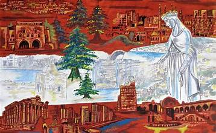

<head>
    <link rel="stylesheet" href="style.css">
</head>

# Culture of Lebanon

Lebanon boasts a rich and diverse culture that reflects its long history and the various civilizations that have influenced it over the centuries. From its vibrant cuisine to its traditional music, Lebanese culture is a blend of various influences, making it unique.

## Cuisine

Lebanese cuisine is renowned for its delicious flavors and healthy ingredients. Some popular dishes include:

- **Tabbouleh**: A fresh salad made from parsley, tomatoes, mint, onion, and bulgur, dressed with olive oil and lemon juice.
- **Hummus**: A creamy dip made from blended chickpeas, tahini, lemon juice, and garlic.
- **Kibbeh**: A dish made of ground meat (usually lamb or beef) and bulgur, often shaped into balls or patties.
- **Baklava**: A sweet pastry made of layers of filo filled with nuts and sweetened with honey.

## Festivals and Traditions

Lebanon is home to numerous festivals that celebrate its cultural heritage. Notable examples include:

- **Beirut Spring Festival**: A celebration of arts and culture, featuring music, dance, and visual arts.
- **Lebanon’s Independence Day**: Celebrated on November 22nd, this day marks Lebanon's independence from France in 1943, with parades and cultural events.

## Music and Dance

Lebanese music is a fusion of various styles, reflecting the country's diverse heritage. Traditional music often features instruments such as the **oud** (a stringed instrument), **derbakeh** (a type of drum), and the **kanun** (a zither-like instrument). The **Dabke** is a popular traditional dance that is performed at celebrations and weddings.

## Art and Literature

Lebanon has a rich tradition of literature and art. Notable figures include:

- **Khalil Gibran**: A renowned poet and writer, best known for his book "The Prophet."

## Conclusion

Lebanese culture is a vibrant tapestry woven from various influences, reflecting the country’s history and identity. Its culinary delights, rich traditions, and artistic contributions continue to thrive and evolve, making Lebanon a unique cultural destination.

